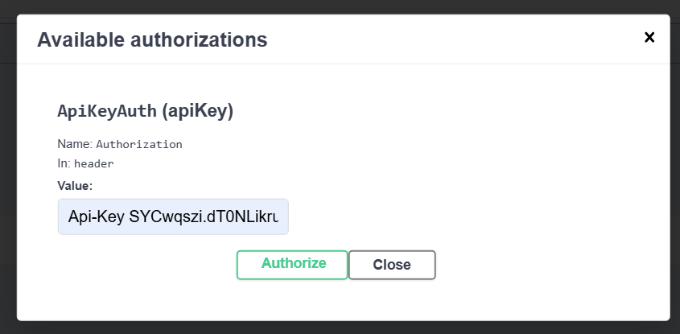
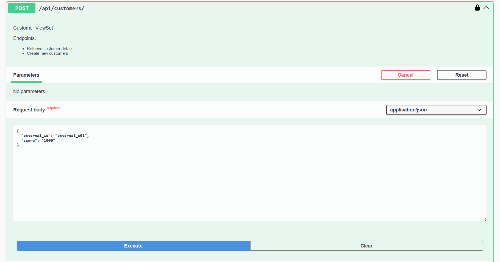
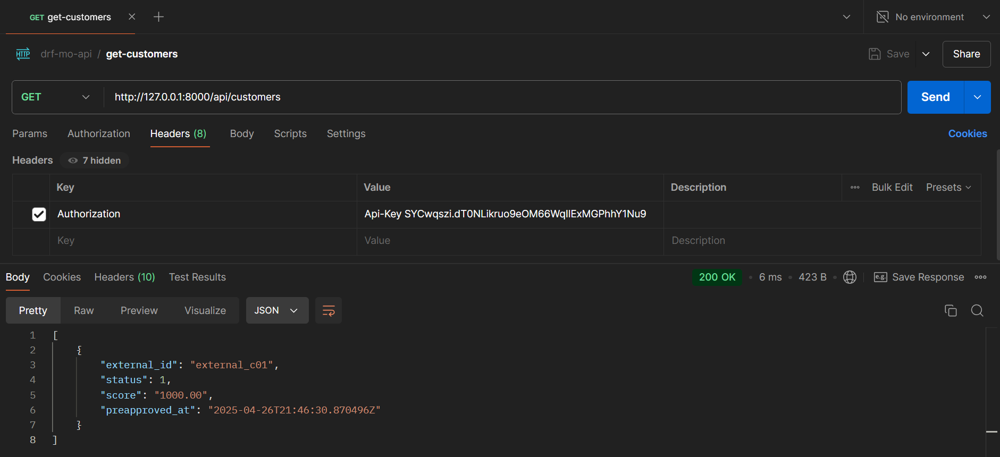

## Introducción

Esta API permite interactuar con un sistema de gestión de préstamos, donde los usuarios pueden realizar diversas acciones relacionadas con la creación, actualización y consulta de clientes y préstamos. Para garantizar la seguridad de las solicitudes, los usuarios deben autenticar sus peticiones utilizando una API Key.

## Tecnologías Utilizadas

- **Python**: 3.12.0
- **Django**: 5.2
- **Django REST Framework**: 3.16.0
- **drf-spectacular**: Para documentación de la API
- **drf-api-key**: Para autenticación basada en API Key

## Configuración del Proyecto

1. Crear un entorno virtual
    ```bash
    python -m venv .venv

2. Activar el entorno virtual
    ```bash
    .\.venv\Scripts\activate

3. Instalar dependencias
    ```bash
    pip install -r requirements.txt

4. Correr el servidor de desarrollo
    ```bash
    python manage.py runserver

Por motivos de practicidad, el repositorio incluye la base de datos utilizada en el proceso de desarrollo, esta ha sido truncada para remover datos de prueba, solo persiste la API Key necesaria para consumir el API. No es necesario crear ni ejecutar migraciones. En caso de que requiera interactuar directamente con los modelos de la solución, en la siguiente sección se proporcionan las credenciales de acceso al panel de administración.

## Panel de Administración

El panel de administración está disponible en la URL http://127.0.0.1:8000/admin/.

Para acceder, puede usar las siguientes credenciales:

- **Usuario**: admin
- **Contraseña**: admin


## Uso de la API Key

Para realizar peticiones a la API, se debe incluir el siguiente encabezado en cada solicitud.

**Authorization:** Api-Key SYCwqszi.dT0NLikruo9eOM66WqIlExMGPhhY1Nu9

## Swagger

La API cuenta con una interfaz de documentación interactiva basada en Swagger. Disponible en la URL http://127.0.0.1:8000/api/schema/swagger-ui/. En el Swagger puede encontrar el detalle de todos los endpoints disponibles.

## Como consumir el API en Swagger

En la sección de autenticación debe gregar el valor de la API Key, de la siguiente manera:



Una vez autorizado, es posible interactuar con el Swagger para probar los diferentes endpoints. Los métodos POST se envian como se observa a continuación:



## Como consumir el API en Postman

En la sección de encabezados debe agregar la llave **Authorization** y el valor de la API Key, de la siguiente manera:



## Pruebas unitarias

El proyecto cuenta con un conjunto de pruebas unitarias que validan la correcta funcionalidad de los principales componentes de la API.

Para ejecutar las pruebas, utilice el siguiente comando:

```bash
python manage.py test --verbosity=2